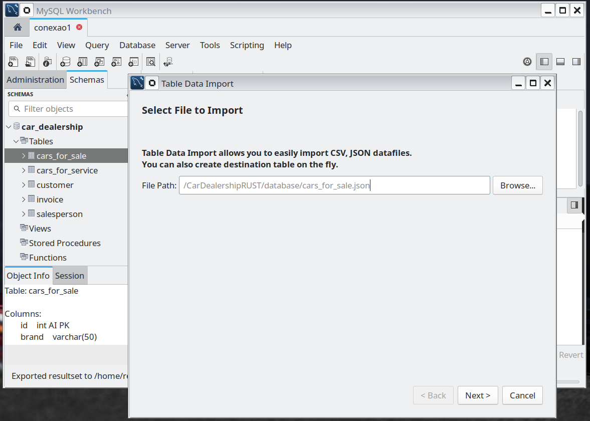

# CarDealershipRUST
Sistema para concessionária de carros

# Steps to run the project
- create the database using the script located in the database folder
- seed the database with cars_for_sale.json

- cargo build  // diesel ORM needs the path of the client lib for the database
- cargo run
